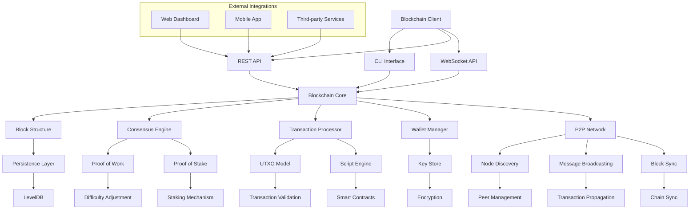
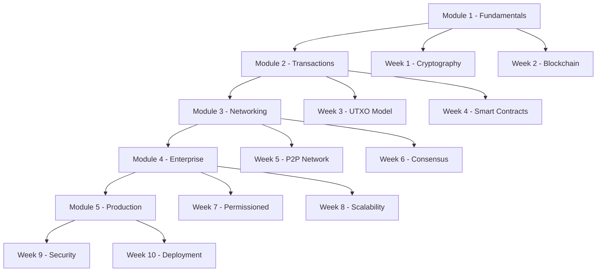
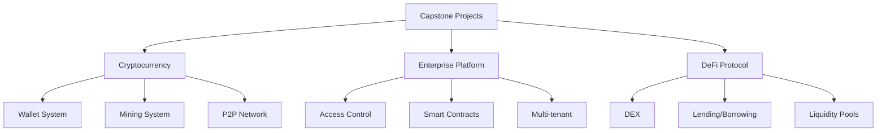

# Blockchain System Architecture

## Overview
This document provides a visual representation of the blockchain system architecture implemented in this course.

## Core Components Architecture

## Data Flow Diagram

```mermaid
graph LR
    A[User] --> B[Create Transaction]
    B --> C[Sign Transaction]
    C --> D[Submit to Network]
    D --> E[Broadcast to Peers]
    E --> F[Validate Transaction]
    F --> G[Add to Mempool]
    G --> H[Mine New Block]
    H --> I[Add Block to Chain]
    I --> J[Propagate Block]
    J --> K[Update Wallet Balances]
```

## Module Dependencies

## Capstone Project Options

